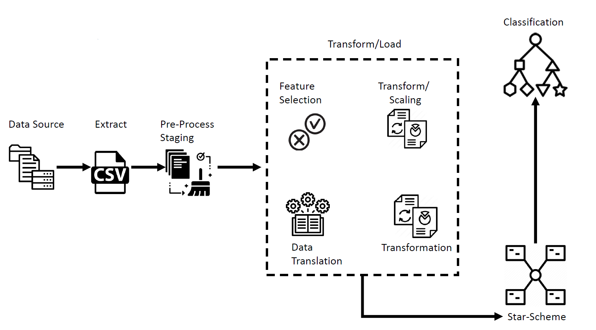
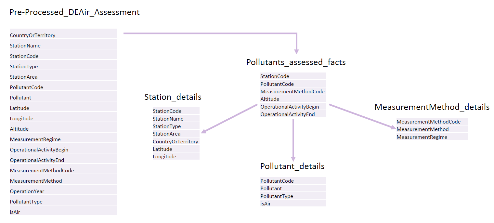

# ETL of German Air Assessment Methods and Prediction of pollutant as aerosol. 

Different Air assessment methods of pollutants in the air across Germany from 1975 to 2019 is obtained from [European Environment Agency](https://www.eea.europa.eu/data-and-maps/data/aqereporting-8/emetadata/european-2014-metadata).
The obtained raw data is filtered for German region. Later the data is pre-processed and wrangled to form a star scheme database structure. 

## Objective
Generate a star scheme of air assessment methods and predict whether the pollutant being assessed is present as an aerosol depending on the station’s geographical characteristics and the method employed to assess the pollutant.

## ETL Pipeline

## Star Scheme generated

